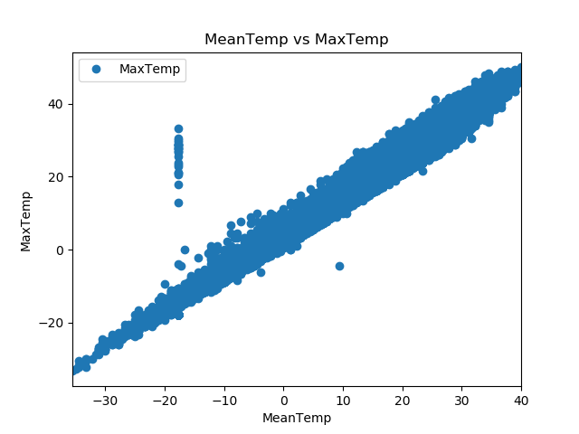
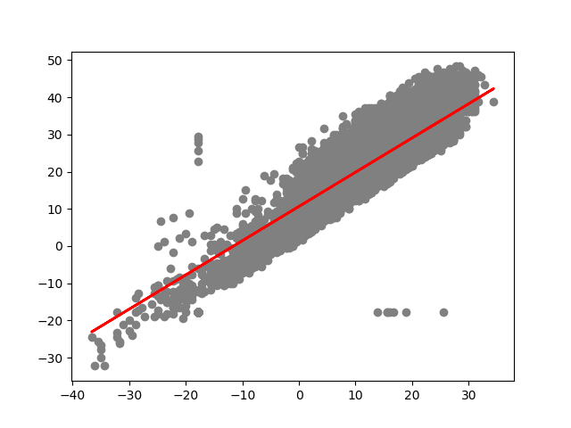

# Basic Linear Regression

The following contains a basic algorithm making use of `pandas`, `sklearn`, and `matplotlib`

Head over to the `linear_regression.py` file for more!

## Data

## Prediction

